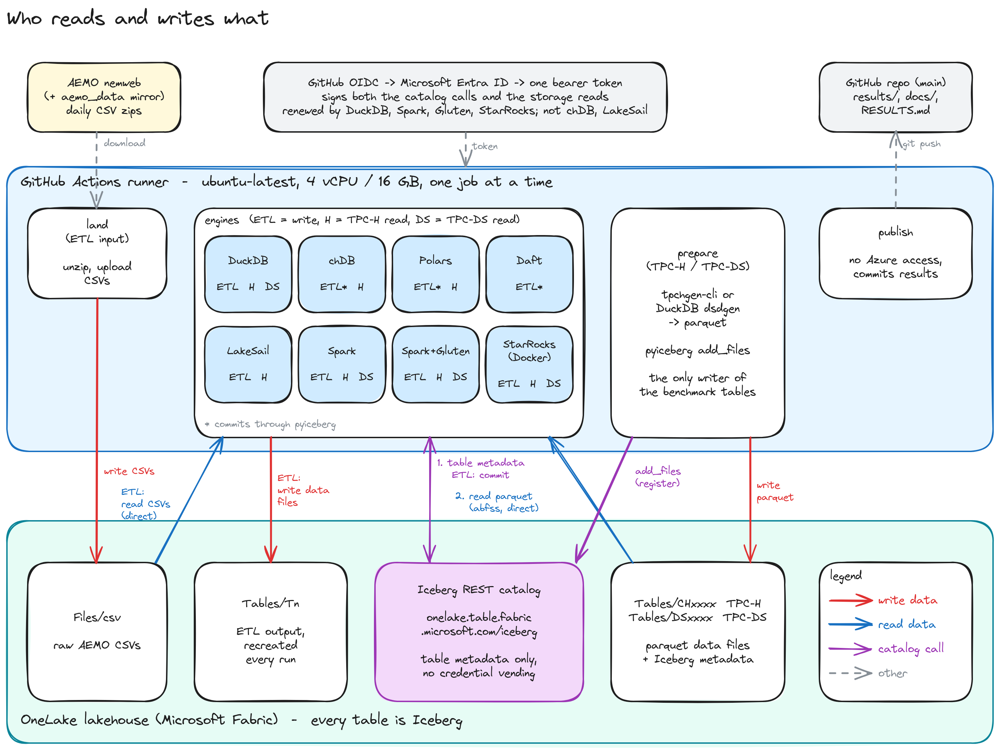

# Learnings

What running small data on small compute taught us, on a 4 vCPU / 16 GB runner reading Iceberg on
OneLake. Free disk is ~14 GB, or ~105 GB once `bench.yml` clears the toolchains for SF≥30. The
numbers come from `docs/data/*.csv`, the job logs and the commits cited. The general lessons come
first, then one section per engine.



## The bottleneck is getting bytes off OneLake, not compute

- A query engine here spends most of its time waiting on remote reads. DuckDB with its file cache
  turned off, same wheel and same run, one line changed (c2871af):

  | | cache on | cache off |
  |---|---:|---:|
  | TPC-H SF=10, cold | 44.3 s | 80.2 s |
  | TPC-DS SF=10, cold | 92.1 s | 370.3 s |

- Stock Spark issues 2 × 4 MB reads in flight per stream (hadoop-azure defaults), so a tens-of-MB
  column chunk becomes a chain of round trips. The bench raises this to 4 × 8 MB.
- Engines share one pipe to the lakehouse. Run in parallel, every engine's time swung 20–50%
  between identical runs, so jobs run one at a time (`max-parallel: 1`, `concurrency: onelake`).

## Metadata round trips are a per-statement tax

On small data a query computes in under a second, so a fixed per-statement cost is visible.

- **Catalog.** Without a metadata cache, every statement re-resolves each table over REST. The
  defaults disagree: Spark's Iceberg catalog 30 s, Sail off. The bench sets one lifetime,
  `CATALOG_CACHE_SECONDS`, for every engine, as a fairness setting.
- **A cache setting is not always the cache you think.** Sail's `table_cache_*` caches the
  namespace *listing*, and `loadTable` still runs for every table in every statement. That leaves a
  1.5–3 s floor under Q11/Q16/Q22 ([lakehq/sail#2629](https://github.com/lakehq/sail/issues/2629)).
- **Manifests.** Iceberg's catalog cache keeps the table object, not its manifests. Spark needs the
  manifest cache as well (off by default), or Q11/Q16/Q22 have a ~5 s floor.
- **Credential vending** costs ~7 s per table, inside the first query that touches the table, so
  it is off.
- **Session start** is timed separately and kept out of totals. It is 2–9 s for DuckDB, chDB,
  Polars and Sail, 9–28 s for Spark, and 19–46 s for Spark + Gluten. A whole TPC-H SF=10 suite can
  take under a minute.

## Caches: the biggest lever, bounded by the box

- A data cache pays off **within a single cold pass**, because later queries re-read the same
  files. See the DuckDB table above. Gluten's Velox cache is off by default. Turning it on
  (8 GB SSD + 1 GB memory) took TPC-H SF=10 cold from 249.6 s to 123–160 s (fd1d3ef).
- It only helps while the working set fits. DuckDB, warm pass against cold:

  | | cold | warm | gain |
  |---|---:|---:|---:|
  | TPC-H SF=10 | 44.3 s | 23.9 s | 46% |
  | TPC-DS SF=10 | 92.1 s | 68.5 s | 26% |
  | TPC-DS SF=60 (~18 GiB > RAM) | 1,367.0 s | 1,280.7 s | 6% |

  So both suites now run **cold only**, and the averages are over 3 runs. Past RAM, a warm pass
  measures little and doubles the run.
- Size the cache to the disk, not the data. ClickHouse does not check free space, so an
  oversized chDB cache gives ENOSPC in the middle of a query rather than evicting. It is clamped
  at 1.5× the dataset, 2–8 GiB (`chdb_cache_gib`).

## A cache has to outlive the credential

- The Entra token lives about an hour, and a OneLake SAS at most an hour. Several engines take
  the token as a string at setup and never refresh it.
- Spark's catalog bearer is a fixed header that cannot be refreshed. When the table cache expired
  mid-run, the next lookup presented a dead bearer, and the statements after it failed. Raising
  the cache from 15 min to 2 h fixed TPC-DS SF=10 (0b65692). Raising it to 6 h, above the job
  cap, fixed SF=30/60 (680aa25).
- Where a credential must be replaced, the engine restarts between statements when less than 15
  minutes remain. The restart empties the catalog, manifest and Velox caches, and that cost is
  left in the numbers.

## Past memory: which engines hold up

Largest scale each engine completes, cold, every statement answered:

| Engine | TPC-H | TPC-DS | What breaks it next |
|---|---|---|---|
| Gluten/Velox | SF=100 (1,008 s) | **SF=100** (4,768 s; 6,757 s on Iceberg 1.11) | TPC-H SF=300: disk. A shuffle write hits `No space left on device`; memory never fails |
| DuckDB | **SF=300** (3,227 s) | SF=60 (1,367 s) | TPC-DS SF=100 Q64: a bad join plan hits the 90.6 GiB spill limit |
| StarRocks | SF=100 (688 s) | — | TPC-DS: Q49, Q70, Q86 are StarRocks SQL bugs (#79806, #79807) |
| LakeSail | SF=100 (2,476 s) | — | TPC-DS: 8 double-quoted aliases didn't parse (now backticked for it); Q71 passes on 0.7.2 |
| Spark-OSS | SF=60 (2,318 s) | SF=60 (9,303 s) | TPC-H SF=100 Q21: `NOT IN` forces a broadcast of ~100M keys; not even a 13 GB heap holds it |
| chDB | SF=60 (834 s) | — | TPC-H SF=100: Q4 would use 11.26 GiB in the Iceberg reader, past the 12 GB cap (run 36291516917); TPC-DS aborts in glibc at any SF |
| Polars | SF=10 (82–106 s) | — | TPC-H SF=30: runner OOM-killed at Q7; TPC-DS SF=10: runner lost at 55 min |

- **Velox is the robust one.** It runs on a fixed budget of 9 GB off-heap plus 3 GB heap, and it
  is the only engine that finished TPC-DS at SF=100. Not one of its failures at any scale came
  from memory: up to SF=100 every one was an expired credential, and at TPC-H SF=300 it is the
  disk (see Gluten/Velox below). Where both finish, DuckDB is faster: TPC-H SF=100 in 500 s
  against 1,008 s.
- **An engine with no memory bound dies; it does not slow down.** Polars (streaming engine, no
  limit, no spill directory) and Sail (DataFusion's pool, unbounded by default) run normally and
  then take the whole runner with them.
  - Polars at TPC-H SF=30 answered Q1–Q6 in ordinary times (27.5 / 9.2 / 8.6 / 5.5 / 13.0 /
    6.8 s), then the runner was killed 75 s into Q7 (run 36001440696).
  - Exit 143, no traceback, and no row in the results. Only the job log shows it happened.
  - It is a cliff, not a slow spill.
  - Sail was the same until it got a bound: a 10 GiB `fair` pool took TPC-H SF=30 from a dead
    runner to 21/22, and the last one, Q18, was a hash join, which DataFusion can't spill.
    Sort-merge joins (`prefer_hash_join=false`) spill, and with them Sail completes SF=30, 60
    and 100. They cost the join-heavy queries 3–5× at SF=10, where every hash table fits, so
    Sail switches to them only once the dataset passes half the pool.
  - Giving Polars a budget (`POLARS_OOC_MEMORY_BUDGET_MB`, experimental) stopped the runner dying
    but did not finish: SF=30 stalled and was cancelled (run 36238938131).
- **A hard limit fails the query, not the runner.** chDB's `max_memory_usage` (12 GB) raises
  `MEMORY_LIMIT_EXCEEDED`, and the run carries on to the next statement.
- **Spilling is only as good as the plan.** DuckDB's Q64 takes 24.9 s at SF=60. At SF=100 the
  same bad join order spills until it hits 90.6 GiB.
- **The ETL is not memory-bound.** DuckDB, Polars, chDB, Sail, Spark-OSS and Daft all finish
  1000 files (52 GB of CSV) in every run. The engines stream the CSVs and never hold the dataset.

## Gluten/Velox

- **No release, a nightly.** Gluten's releases stop at Spark 3.5. Apache's nightly Velox bundle
  covers Spark 4.1 and is tested on 4.1.1, so this engine pins pyspark 4.1.1 while Spark-OSS runs
  4.1.3. Compiling Velox in CI (hours, tens of GB) was ruled out.
- **Getting it to read OneLake took five fixes, each found by a smoke run.**
  1. Velox's ABFS connector only knows SharedKey, OAuth *with a client secret*, and SAS. There is
     no secret and OneLake has no account key, so the engine mints a 1-hour user-delegation SAS
     (bd46001).
  2. An unscoped `fs.azure.account.auth.type` key crashed the native backend at startup:
     `substr: __pos (which is 27) > __size (which is 26)`. Velox cuts an account name off every
     such key, so only account-scoped keys can be used (apache/gluten#10488).
  3. `NoClassDefFoundError: SparkBatchQueryScan`. Gluten sits on the app classpath and could not
     see Iceberg in `spark.jars.packages`' child loader. Fix: resolve the jars first and put them
     on `extraClassPath` (8e0a936).
  4. `Problem with the SSL CA cert`. The bundle's libcurl was built on CentOS and looks in
     `/etc/pki/tls/certs`, so CI symlinks Ubuntu's bundle there (d4901a2).
  5. ANSI. With ANSI off, TPC-DS's double-quoted aliases fail to parse. With ANSI on, Gluten hands
     every plan back to Spark. The answer is ANSI on with `ansiFallback=false`, so Velox executes
     ANSI itself (2588769).
- **The SAS lives an hour.** TPC-DS SF=100 answered Q1–Q74, then every statement from Q75 on got
  `401`, 54 minutes in (run 35998250865). Swapping the SAS in a live session doesn't work: Gluten
  builds Velox's ABFS config once, at backend init. So the engine restarts its JVM between
  statements once less than 15 minutes of SAS remain (d43a4e4). The next run finished 99/99
  with two restarts.
- **Its cache is off by default.** Velox has a two-tier file cache, and turning it on (8 GB SSD +
  1 GB memory) took TPC-H SF=10 cold from 249.6 s to 123–160 s (fd1d3ef). The load quantum must
  be 8 MB: Gluten's default of 256 MB refused to start ("only support up to 8MB load quantum
  size on SSD cache", 4ec3161).
- **Q72 is a known Gluten problem** (apache/gluten#8417). Gluten forces shuffled hash joins, and
  Q72's join chain explodes under them. The fix is Gluten's own TPC-DS benchmark config: SHJ
  stays forced, with `physicalJoinOptimizeEnable` at level 18, runtime bloom filters, no memory
  over-acquire, and 9g off-heap / 3g heap. That took Q72 at SF=1 from 36.8 s to 5.1 s, and a
  six-query smoke from 55.1 s to 20.4 s (5284048). Turning SHJ off got nowhere, and so did
  Spark's CBO.
- **More reads in flight didn't help.** IO threads 4→16 with row-group prefetch 1→4 was slower on
  every query: 31.7 s against 20.4 s (914a548, reverted).
- **At TPC-H SF=300, spill to disk is the ceiling.** Memory holds: Velox spills inside its 9 GB
  budget, and the runner has ~105 GB of free disk for it. What runs out is that disk.
  - Run 36304713315: `/` filled about 15 minutes into the queries, and the runner itself died
    (`No space left on device` on the runner's own log file, so no job log survived). Spark keeps a
    finished query's shuffle files until the JVM collects the shuffle (forced every 30 minutes),
    so every earlier query's shuffle was still on disk.
  - `spark.sql.classic.shuffleDependency.fileCleanup.enabled` (Spark 4.1) now deletes them at the
    end of each query. Run 36306511351 then failed inside a single query, about 19 minutes in,
    with the runner still alive:
    `GlutenException: Native shuffle write: ShuffleWriter stop failed - IOError: Error writing
    bytes to file. Detail: [errno 28] No space left on device`.
  - `/mnt` is not a second disk on these runners. `df` shows the same `/dev/root` for `/` and
    `/mnt`, so moving the spill there changes nothing.

### The ETL's CSV read runs on plain Spark, not Velox

- Run 36214140962, 2026-09-26 (10 files): the ETL load succeeds, but the log says
  `Validation failed for plan: Scan csv ... Unsupported file format TextReadFormat`. Plain Spark
  reads and parses the CSVs; Velox only runs the filter, casts and Parquet write after that.
- Why: open-source Gluten on Spark 4.x has no CSV reader. Velox itself cannot read CSV
  (apache/gluten#5414, open). Gluten used to have an Arrow-based CSV reader behind
  `spark.gluten.sql.native.arrow.reader.enabled`, but it was switched off for Spark 4
  (apache/gluten#11190) and then deleted (#12130, #12737). No setting brings it back.
- Effect on the ETL numbers: expect Gluten/Velox's load time to be close to Spark-OSS,
  because the CSV parse is most of the work.

## DuckDB

- **The fastest wherever it finishes**, and it runs on defaults: no `memory_limit`, no
  `temp_directory`, no `threads`.
- **The external file cache is the only cache it turns on by itself**, and it is worth
  1.8–4× in a single cold pass (see the table at the top). The object, HTTP-metadata and
  parquet-metadata caches stay off.
- **TPC-DS SF=100 Q64.** It ran ~257 s, then failed with `OutOfMemoryException: failed to offload
  data block of size 256.0 KiB (90.6 GiB/90.6 GiB used)`. That is DuckDB's spill ceiling, hit with
  105 GB of disk free. The same query takes 24.9 s at SF=60; the join order is what blows up
  (duckdb/duckdb#21896). The same run also lost Q88–Q99 to `Unauthorized` 65 minutes in, because
  the token baked into its `CREATE SECRET` had expired.
- **TPC-H SF=300 now completes on the nightly CLI** (run 37429290996, 2026-10-06,
  `v2.0.0-alpha44357`): 22/22 cold in 3,227 s, Q18 in 155 s, Q21 the slowest at 614 s.
  duckdb/duckdb#22474 is still open; the change is almost certainly duckdb/duckdb#26246 (merged
  2026-09-30, in alpha44357, not in any 2.0 wheel yet -- the Oct 1 wheel's core is 101 commits
  behind it). `memory_limit` bounded live buffers but not RSS: jemalloc keeps freed spill buffers
  resident as dirty pages until its decay runs, so a spilling aggregate grew RSS past the box while
  the buffer manager stayed under its limit -- the dead runner below. The buffer pool now purges
  the allocator once freed-but-resident bytes would push usage past the limit. Not A/B-tested. Row counts match StarRocks' SF=300 run except Q11
  (280,546 vs 280,725): Q11 keeps groups above a fraction of the total, so groups at the threshold
  flip with float summation order, and StarRocks was a few rows off at SF=30 and 60 too, where
  DuckDB, chDB and Trino agreed. The history of the failure, before that:
- **TPC-H SF=300 Q18 took the runner down** (run 36297418366). The job died 80 minutes in with
  "The hosted runner lost communication with the server": no job log, no result row. The timing
  puts it in Q18. At SF=200, Q1–Q17 take 889 s, and SF=300 ran 1.6× slower on Q1–Q8, so Q18
  started around minute 24 and ran ~55 minutes. At SF=200 it takes 60 s.
  - Q18 is `GROUP BY l_orderkey HAVING sum(l_quantity) > 300` over 1.8 B rows, ~450 M groups.
  - That shape is an open DuckDB problem. Past ~1 M groups the hash aggregate's local states are
    never compacted, so memory and spill grow with the input rows, not the groups
    (duckdb/duckdb#22474, open, no PR as of 2026-09-28). Its repro is Q18's shape: 1 B rows into
    2 M groups fails at 4 GB with an 8 GB spill cap. Q18 at SF=100 hit an OOM before
    (duckdb/duckdb#10192).
  - Not a regression. A high-cardinality `GROUP BY` on lineitem that passed on 1.3.2 fails on
    1.5.2, and DuckDB closed it as expected: 1.3.2 undercounted and ran 50% over its limit; the
    query just needs that much memory (duckdb/duckdb#22578).
  - Merged spill work doesn't cover it: #24499 spills arena-backed states (strings, `first`,
    `list`), and Q18's `sum` state is fixed-size.
  - A dead runner, not an `OutOfMemoryException`, is the sign of memory the buffer manager doesn't
    count: `memory_limit` (80% of RAM by default) never trips, and the box runs out first.
- **The azure extension's default transport fails OneLake's TLS handshake on Linux**, while the
  catalog `ATTACH` (plain HTTPS through the iceberg extension) succeeds. Every data-file read then
  fails with `AzureStorageFileSystem could not open file`, which reads like a credential problem.
  The fix is `curl`, which `config.azure_transport()` picks off Windows. On Windows it is the reverse.
- **Credential vending works but costs ~7 s per table** inside the first query that touches it.
  It is off (`ACCESS_DELEGATION_MODE 'none'` plus a `CREATE SECRET`).
- **Its Iceberg writer was tried for TPC-DS generation and dropped.** At SF=10 it wrote
  `store_sales` (1.2 GB) in 30 s, then hung on `inventory` (133 M rows) for 45 minutes (run
  35726316639). Generation now writes parquet with DuckDB and registers it with pyiceberg
  `add_files`, the same path as TPC-H.
- **dsdgen output differs between DuckDB 1.5.5 and the 2.0 nightly**: same row counts, different
  values. The generator must be the DuckDB engine's own build, or engines on different builds
  compare different data. The workflows pass the generator's nightly run id to the DuckDB job.
- **The engine is the nightly CLI, not the PyPI dev wheel** (2026-10-06). The wheel only moves to
  a new core when duckdb-python merges a submodule bump, a manual PR: `2.0.0.dev2610011535` was on
  `alpha43763` while the nightly was at `alpha44578`. But the newest nightly CLI usually cannot load
  iceberg: DuckDB publishes a nightly's extensions only when its "Deploy extensions" job runs, which
  is skipped if any extension build fails (1 of the last 10 nightlies). So
  `.github/scripts/duckdb_nightly.py` takes the newest nightly whose iceberg, avro, azure, httpfs
  and tpcds are on extensions.duckdb.org. `bench/duckdb_cli.py` drives one CLI process per run
  over stdin.

## Spark-OSS

- **Cost-based join reordering is off by default** in Spark 4.1 (`spark.sql.cbo.*` all false).
  AQE re-plans joins at runtime but never reorders them, so Spark joins in the order the SQL is
  written. TPC-DS Q72 in its written order took 341 s at SF=10 (run 35789548458), 16% of Spark's
  2,170 s suite. DuckDB answers it in 3.4 s.
  - Turning CBO on made it worse. With Iceberg's statistics, Q72 at SF=1 was still running after
    7 minutes where it had taken 21 s.
  - Spark's `ANALYZE TABLE` doesn't support Iceberg tables, so a better plan needs Puffin NDV stats.
- **TPC-H SF=100 Q21 fails twice, 21/22** (runs 36016179553, 36151085980). The error is
  `STAGE_MATERIALIZATION_MULTIPLE_FAILURES`, "Not enough memory to build and broadcast the table",
  after ~3.5 minutes. It passes at SF=60 in 280 s.
  - It's not AQE's choice. Q21 is written `l_orderkey NOT IN (subquery)`, and every Iceberg
    column here is nullable, so Spark must plan a *null-aware* anti join. Spark always broadcasts
    those (`BroadcastHashJoin LeftAnti ... true`), whatever the thresholds say. The build side at
    SF=100 is ~100M order keys.
  - Nothing in config holds it (temp-CI runs 36287446363, 36289407788): both broadcast thresholds
    at -1, `spark.memory.fraction` 0.8, a 13 GB heap, and both together all fail the same way at
    ~230 s. The build needs more than one JVM on a 16 GB box can have.
  - The fix would be the query: `NOT EXISTS` is a plain anti join and sort-merges. The SQL stays as
    written, so this stays a failure. Gluten passes it, building off-heap in Velox.
  - An engine gets a totals bar at a scale only when every statement completes, so Spark-OSS has
    no TPC-H SF=100 bar.
- **Its catalog bearer cannot be refreshed.** Iceberg's `token` property sends a fixed header, and
  Fabric advertises no OAuth token endpoint. Storage is fine: hadoop's
  `WorkloadIdentityTokenProvider` mints ABFS tokens from the OIDC assertion indefinitely. The
  catalog is not.
  - Every time the table cache expired, the next lookup presented a dead bearer:
    - 21 statements of TPC-DS SF=10 failed with `NotAuthorizedException` at a 15-minute cache;
    - 15 statements from Q62 on at SF=30 and SF=60 failed at a 2-hour cache.
  - Fix: the cache went to 6 h (above the job cap), and the session restarts on a fresh bearer
    when less than 15 minutes remain (0df4505).
- **Two Iceberg defaults cost it seconds per statement.**
  - The catalog cache expires after 30 s.
  - The manifest cache is off, so every statement re-reads the manifest list and every manifest
    over ABFS. That is a ~5 s floor under Q11, Q16 and Q22, which don't touch lineitem.
  - Both are on now.
- **hadoop-azure's read defaults are timid.** Queue depth 2 × 4 MB requests means a tens-of-MB
  column chunk becomes a chain of round trips, two at a time; Q6 took 11 s where Sail took 3 s.
  Raised to 4 × 8 MB, which exactly fills the 16-buffer pool.
- **TPC-DS SF=30 and SF=60 take the same time** (9,280 s against 9,303 s), so the time goes to
  per-query overhead and bad plans (Q9, Q72, Q23, Q28), not to data volume. At SF=100 it was
  cancelled at Q28 after 2 h 54 min.
- **It stays on Spark 4.1.3.** Spark 4.2 has no released Iceberg runtime: 1.11 stops at 4.1, and
  1.12 leaves 4.2 out. An Iceberg-main nightly ran the ETL but hung TPC-H Q21 at SF=1.

## chDB

- **It was returning a wrong answer, and only the smoke test's row-count compare saw it.** chDB
  returned 41 rows for TPC-H Q13 where every other engine returned 42.
  - ClickHouse defaults to `join_use_nulls=0`, which fills an unmatched outer-join cell with the
    column's default value (`0`) instead of `NULL`.
  - So `COUNT(o_orderkey)` counted the unmatched rows, and the `c_count=0` group vanished.
  - Every published chDB result was wrong until then, at every scale, and invisible to a timing
    chart. It now runs `SET join_use_nulls = 1`, plus `union_default_mode = 'DISTINCT'`, which
    TPC-DS needs.
- **TPC-H SF=60 went from 14/22 to 22/22 (834 s)** with three changes (runs 36016149239,
  36287421972, 36289383167):
  - `JSONDecodeError` on Q4, Q8, Q10 and Q22 was the bench's bug. Each followed a memory error,
    and the failed statement's JSON came back in front of the next one's. A throwaway `SELECT 1`
    after an error now takes the leftover.
  - The bench forced `join_algorithm='grace_hash,hash'` and 5 GB spill thresholds, from before
    ClickHouse had its own. The 26.x defaults (`max_bytes_ratio_before_external_*` = 0.5, the join
    one switching to grace hash only when memory runs short) recovered Q3, Q7 and Q9.
  - Q21 needed 10.41 GiB against a 9.31 GiB cap: its `IN`/`NOT IN` subqueries are hash sets of
    ~100M keys, which don't spill. The cap is now 12 GB a query and 13 GB the process, DuckDB's
    default share of this runner.
- **TPC-DS aborts in glibc on its first query:** `pthread_mutex_lock.c:94 assertion failed`,
  exit 134, no rows. It happened at SF=1 and SF=10, against tables from two different writers,
  so it is chDB 4.4.0, not the data. TPC-H is unaffected.
- **Its filesystem cache doesn't check free space.** A `max_size` bigger than the disk is an
  ENOSPC mid-query, not an eviction. The Fabric notebook this came from asked for 150 GiB, 10×
  the runner's disk. The cache is now 1.5× the dataset, clamped to 2–8 GiB (`chdb_cache_gib`).

## Polars

- **Fine at TPC-H SF=10 (82–106 s), gone at SF=30.** It uses the streaming engine with 4 threads
  and no memory limit. At SF=30 the runner was OOM-killed 75 s into Q7, and at TPC-DS SF=10 the
  runner "lost communication with the server" 55 minutes in. See "Past memory" above. It is not
  run at larger scales.
- **Three correctness bugs, all found by comparing row counts across engines on identical data:**
  - [pola-rs/polars#29449](https://github.com/pola-rs/polars/issues/29449): `scan_iceberg`
    decodes negative decimal bounds as unsigned, so TPC-DS q13/48/49/85 fail with "decoded value
    for decimal exceeded precision".
  - [#29462](https://github.com/pola-rs/polars/issues/29462): the same decoder. A filter on a
    decimal column returns **no rows**, silently, when a file's bounds are equal and negative.
    TPC-DS q43 returns 0 rows instead of 6.
  - [#29461](https://github.com/pola-rs/polars/issues/29461): a 2.0.0-rc.2 regression. TPC-DS
    q11 and q31 return one row fewer than rc.1, DuckDB, Spark and Sail, on plain parquet.
    Bisected in CI by pinning rc.1 for one run.
- **2.0.0 (2026-10-06) fixes all three, and breaks TPC-H Q11 at every scale**
  ([#29762](https://github.com/pola-rs/polars/issues/29762)). `SUM(decimal) * (0.0001 / SF)` is
  now `Decimal(38, 12)` instead of `Float64`, and the CROSS JOIN filter against the
  `Decimal(38, 2)` value becomes an inequality join whose `search_sorted` rejects decimals of
  different scales. Bisected rc.2 vs 2.0.0 in a temporary CI job. TPC-DS SF=1 is 99/99 and
  matches DuckDB.
- **TPC-DS Q72 over `scan_iceberg` is the SF=10 killer** ([#29768](https://github.com/pola-rs/polars/issues/29768)).
  Run 37469601767 answered Q1-Q71 in ~6 minutes, then Q72 ran 15 minutes until the runner killed
  it (exit 143). On the same files Q72 is 2.1 s / 0.54 GiB with `scan_parquet` and killed at
  13 GiB after 141 s with `scan_iceberg` (local SQLite catalog, so not OneLake); at SF=1, 0.2 s /
  0.37 GiB against 15.2 s / 6.05 GiB. DuckDB: 0.4 s.
- **Main after 2.0.0 fixes Q11 and Q72 and breaks TPC-DS Q4** ([#29822](https://github.com/pola-rs/polars/issues/29822)).
  A wheel of pola-rs/polars@c36581695d (built in a temporary CI job) ran TPC-H SF=30 at 22/22,
  142 s cold, against 21/22 and 192 s on 2.0.0 (run 37862297743). Over a local Iceberg catalog
  at TPC-DS SF=10 it took Q72 from OOM to 2.6 s, but Q4 went from 34 s / 2.5 GiB to over 12 GiB
  in 5 s, which is what stalled bench run 37859527146. The plan on main reorders Q4's six
  `year_total` self-joins (`__POLARS_JOIN_ORDER_*`); 2.0.0 keeps the SQL order.
  `use_metadata_statistics=False` does not help, and `scan_parquet` on the same files is fine.
- **Tables are scanned by name through the catalog** (`scan_iceberg("ns.table", catalog=...)`),
  as a maintainer suggested on [#27776](https://github.com/pola-rs/polars/issues/27776): lazy,
  with the REST scan and manifest caches of #29790 / #29623. The registration loop stays, because
  Polars SQL has no catalog. There is no data-file disk cache to turn on: Polars 2.0 removed it.
- **The best ETL engine by mean.** It streams CSV through `sink_batches` into pyiceberg and loads
  1000 files in ~471 s on average (455–480 s), against DuckDB's ~497 s (414–561 s).

## LakeSail

- **Its table cache caches listings, not tables.** `table_cache_type` / `table_cache_ttl_secs`
  cache the *list of tables in a namespace*, consulted by `list_tables` only. The docs say "table
  listing cache", and the bench misread the name.
  - The two calls a query makes, `get_table` and `begin_table_access`, go straight to the REST
    provider, which calls `loadTable` every time (`sail-catalog/src/provider/cache.rs:314`,
    `sail-catalog-iceberg/src/provider.rs:1434` at v0.7.1).
  - The logs show it: every statement emits one `advertises vended storage credentials` warning
    per table it touches.
  - Consequences:
    - a 1.5–3 s floor under Q11, Q16 and Q22 at SF=10, where the caching engines answer in under
      a second;
    - a `loadTable` that stalls lands in whatever statement runs next, which caused one 20–25 s
      stall per warm pass on a different query each time, back when there was a warm pass.
  - Filed as [lakehq/sail#2629](https://github.com/lakehq/sail/issues/2629).
  - A fork patch that cached loaded tables made TPC-H SF=10 19% faster cold. PR #2639 was
    closed. Fork CI showed that a cache the write path can reach feeds stale tables to
    `INSERT OVERWRITE` and CTAS, and gives UPDATE/DELETE/MERGE commit conflicts.
- **Its memory pool is unbounded by default, so it never spills.** At TPC-H SF=30 the runner was
  OOM-killed 46 s into Q18, after Q1–Q17 had run fine. Now a 10 GiB `fair` pool
  (`runtime.memory_pool.*`), plus sort-merge joins past half the pool, and it completes TPC-H up
  to SF=100 (see "Past memory" above).
  - An earlier guess, `SAIL_EXECUTION__MEMORY_LIMIT`, is not a real key. Sail validates its
    config strictly and refused to start.
- **TPC-DS at SF=10: 90/99 cold.**
  - The parser rejects the spec's double-quoted aliases (`AS "order count"`, 8 statements).
  - Q71 fails with "Physical input schema should be the same", an aggregate over a UNION ALL of
    joins on Iceberg tables ([lakehq/sail#2642](https://github.com/lakehq/sail/issues/2642)).
  - The warm pass then lost 42 statements to `400 Bad Request` once the token baked into its
    environment expired.
  - It was dropped from TPC-DS and kept in TPC-H and the ETL.
- **0.7.2 (DataFusion 55) made TPC-DS 37% faster.** SF=10 cold, run 36648458503: 91/99 in
  1,458 s. On the 90 statements both versions answer, 2,289 s became 1,444 s. 74 of them got
  more than 20% faster, and the scan-bound ones by 3–7× (Q39 65→9 s, Q21 66→9 s, Q37 68→10 s).
  4 got more than 20% slower (Q59 21→44 s, Q63 20→35 s, Q79 21→35 s, Q24 29→39 s).
  - Q71 passes (9,669 rows), so #2642 is fixed by the DataFusion upgrade.
  - The 8 double-quoted aliases still fail. Sail's parser has an `allow_double_quote_identifier`
    switch, but its analyzer always builds `ParserOptions::default()`, which leaves it off.
    `spark.sql.ansi.doubleQuotedIdentifiers` appears in Sail's config list but never reaches the
    parser. `bench/tpch/queries.py` hands Sail those aliases in backticks, which gives the same
    column names.
  - TPC-H SF=10 did not move: 221 s, inside 0.7.1's 118–236 s spread. Every statement still
    reloads its tables (#2629), and Q22 absorbed a 23 s loadTable stall.
- **Its ETL table has no `filename` column.** The DataFrame transform it shares with Spark
  (`_spark_df.py`) leaves it out because Sail can't provide it.
- **Late materialization made it slower.** `SAIL_PARQUET__PUSHDOWN_FILTERS` should help Q6, Q12
  and Q19 most, and they came out the worst of four runs (5.9 s, 6.3 s, 7.2 s). Over object
  storage the row-filter pass costs extra range requests.

## Daft: in the ETL, not in the query suites

- **It runs 16 of 22 TPC-H queries** at 0.7.25
  ([Eventual-Inc/Daft#7532](https://github.com/Eventual-Inc/Daft/issues/7532)):

  | Q | failure |
  |---|---|
  | 1, 9 | `Cannot infer supertypes for multiply/subtract`: `Decimal[38,4] × Decimal[23,2]` wants precision 61, and Daft's ceiling is 38 |
  | 8, 14 | `if_true and if_false ... Decimal[38,4] and literal#Int64`: the same coercion gap, inside a `CASE` |
  | 11 | `Unsupported join type: CrossJoin(None)` |
  | 22 | `` `SUBSTRING(expr [FROM start] [FOR len])` syntax`` |

  Correlated subqueries, `EXISTS`, `IN (SELECT …)` and CTEs all work. The blocker is decimal
  arithmetic: `l_extendedprice * (1 - l_discount)` overflows where every other engine widens or
  falls back to float. Rewriting six queries isn't a benchmark, and casting to double would change
  what every other engine computes.
- **It rejects backticks outright**: "Daft only supports delimited identifiers with
  double-quotes". That failed all 22 queries at first and looked like a total dialect failure
  until the error was read. Hence the third `IDENT_STYLE`, `quoted`.
- **It can't address OneLake with `abfss://`.** `parse_azure_uri` only honours
  `container@host` when the host ends in `.dfs.core.windows.net`. On
  `onelake.dfs.fabric.microsoft.com` it takes the host as the container, and OneLake answers
  `400 FriendlyNameSupportDisabled`. The fix is
  [Eventual-Inc/Daft#7533](https://github.com/Eventual-Inc/Daft/pull/7533). Until it ships, the ETL
  engine reads and writes `az://` paths.

## DataFusion Comet: rejected on `abfss://`

Comet was evaluated as a native execution plugin for Spark and rejected. The two things you'd
expect to stop it don't:
- Spark 4.1 *is* supported (`comet-spark-spark4.1_2.13:1.0.0`).
- Its native Iceberg reader *is* on by default and documented for REST catalogs.

Storage stops it. In `CometScanRule.scala`:

```scala
private val icebergReadableSchemes: Set[String] = Set("file", "s3", "s3a", "gs", "oss")
```

- **No `abfss`, deliberately.** iceberg-rust's OpenDAL factory cannot build Azure storage, so
  admitting it would turn a clean JVM fallback into a native error. OneLake scans would run on the
  JVM exactly as without Comet, while Comet held off-heap memory out of 16 GB.
- **It would also break the credential path.** Native scans bypass Hadoop's ABFS driver and
  rebuild auth in Rust from a fixed allowlist of `fs.azure.*` keys. The custom token provider
  (`WorkloadIdentityTokenProvider`) would never be called. The account is derived from the first
  host label, so OneLake's host is outside its tested URL shape anyway.
- **Revisit when `abfss` appears in `icebergReadableSchemes`.** Filed as
  [apache/datafusion-comet#6058](https://github.com/apache/datafusion-comet/issues/6058).

## StarRocks: a candidate that qualifies

Tried through the `candidate engine` workflow (`.github/scripts/candidate_engine.py`) on
`starrocks/allin1-ubuntu:4.1-latest` (4.1.4), Apache-2.0. It is a server, not a pip install: a
Java front end and a C++ back end in one container, driven over the MySQL protocol. Run
36222032188 passes all three requirements: 22/22 TPC-H at SF=10 (~75 s total in the probe, one
run, not the bench harness), OneLake Iceberg and `Files/csv` reads, and a CTAS that pyiceberg reads
back. It took six runs; four of the failures were probe mistakes, and each looked like a
StarRocks limitation until the error was read closely.

- **The catalog attaches with the bearer alone, but storage doesn't follow.**
  `"iceberg.catalog.security"="oauth2"` + `"iceberg.catalog.oauth2.token"` lists the namespaces,
  with or without `vended-credentials-enabled`. Every data read still failed: whatever OneLake
  vends never reaches StarRocks' hadoop-azure reader, which falls back to SharedKey and reports
  `fs.azure.account.key` null for `onelake.dfs.fabric.microsoft.com` (run 36214160572).
- **Never `azure.adls2.storage_account`.** StarRocks turns it into
  `<account>.dfs.core.windows.net` (`AzureStorageCloudCredential`), so `"onelake"` configures the
  wrong host. pyiceberg avoids the same trap with `adls.account-host`. Leave it empty, and either:
  - **workload identity**, the one that works: `azure.adls2.oauth2_token_file` +
    `oauth2_tenant_id` + `oauth2_client_id` become hadoop's `WorkloadIdentityTokenProvider`, the
    same path Spark-OSS uses. The GitHub OIDC assertion is written to a file, mounted into the
    container, and rewritten every 4 minutes; or
  - a SAS scoped to OneLake's host with `azure.adls2.endpoint` (not needed once workload identity
    passed).
- **Bare `VARCHAR` is VARCHAR(1).** Reading the ragged AEMO CSV with `FILES(... "schema" ...)`
  and a bare `VARCHAR` per column, every value longer than one character loaded as NULL:
  `D` and `1` survived, `DUNIT` and every timestamp did not, so the DUNIT filter matched 0 rows
  where Python's `csv` module finds 138,240. It looked like a column-name bug (`UNIT`), then like
  a padding bug, until the raw fields were printed. Declared as `STRING`, the read matches Python
  exactly: 138,240 rows, sum(TOTALCLEARED) 5,317,923.8173.
- **Ragged CSV is fine once typed right.** The explicit `schema` (4.1.2+) with
  `"fill_mismatch_column_with"="null"` NULL-pads short rows. Default inference fails on these files
  ("Schema column count: 120 doesn't match source value column count: 10").
- **Q22's `SUBSTRING(x FROM 1 FOR 2)` doesn't parse.** `sql/tpch.sql` now uses the comma form,
  `SUBSTRING(x, 1, 2)`, which every bench engine also runs (smoke run 36219112326).
- **OneLake wants the table location.** CTAS works with
  `PROPERTIES ("location"="<base>/Tables/<ns>/<table>")`, as pyiceberg and Spark also have to pass.
- **The lakehouse has no SF=1 TPC-H** (CH0010 and up); the first run failed on that alone.
- **The ETL is one `FILES()` scan over all N files, with no `filename` column.** `FILES()` can't
  expose the source path: `columns_from_path` only reads `key=value` folders, and `path_column`
  is an open PR ([StarRocks#66975](https://github.com/StarRocks/starrocks/pull/66975)). The first
  version gave each file its own `FILES()` scan with the name as a literal, UNION ALL'd. That
  doesn't scale: every branch is a plan fragment holding its buffers until the statement ends,
  even under the phased scheduler. At 1000 files the BE grew ~1.5 GB every 30 s to 11.9 GB and
  was killed (run 36231764513). The uncapped run before it took the whole runner down (exit 143,
  run 36230293425), which is why the container is now capped at 15 GB.
- **TPC-DS SF=10: 94/99 at first** (run 36230441153). Q1 and Q5 hit the 3 s planning cap
  (below, now lifted). The other three are StarRocks bugs, left as failures because the SQL
  stays as written: `grouping()` in ORDER BY is rejected, which fails Q70 and Q86
  ([StarRocks#79806](https://github.com/StarRocks/starrocks/issues/79806)), and a derived table
  aliased `catalog` can't be referenced, which fails Q49
  ([StarRocks#79807](https://github.com/StarRocks/starrocks/issues/79807)).
- **Three defaults were costing it.** Spill is off (`enable_spill`), which lost TPC-H SF=100
  Q18/Q21. Parallelism is half the cores (`pipeline_dop` 0 means 2 on 4 vCPU; the Iceberg sink
  gets 1). Planning is capped at 3 s (`new_planner_optimize_timeout`), and the first query on a
  table loads its Iceberg metadata inside that window: TPC-DS lost Q1 and Q5.
