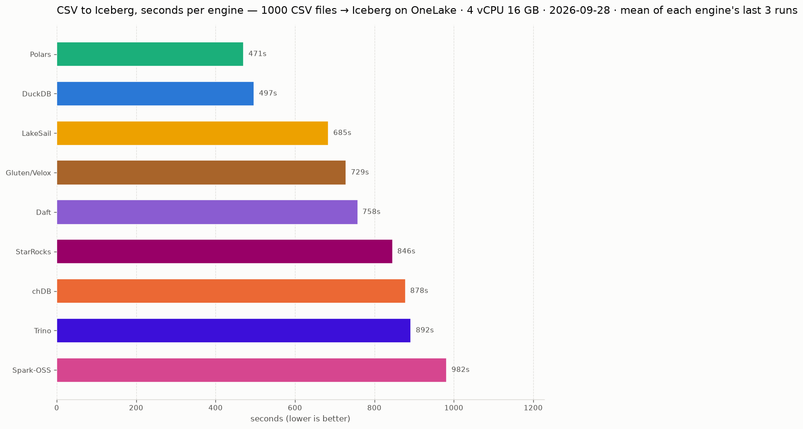
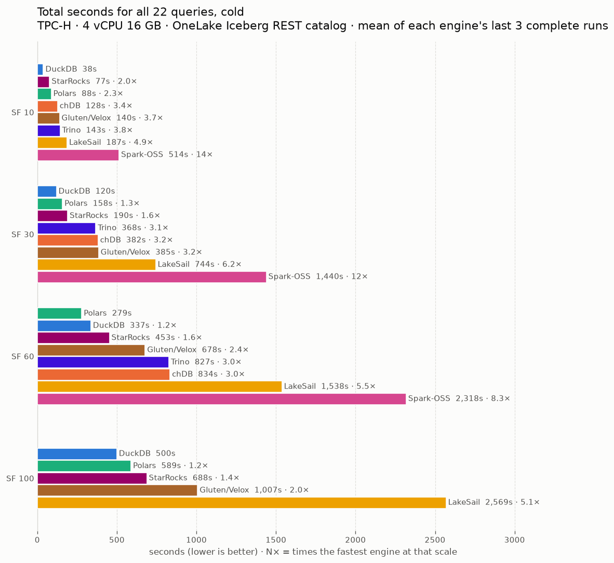
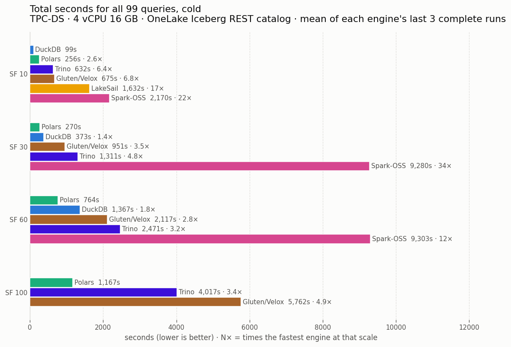

## Small Data Benchmark
Most benchmarks are big data using big compute. Here we are testing small to medium data with small compute. The purpose is to stress test: spill to disk, bad join orders, being hard on engines. Adding more compute just hides the issues.

<picture>
  <source media="(prefers-color-scheme: dark)" srcset="docs/etl/charts/totals-dark.png">
  
</picture>

<picture>
  <source media="(prefers-color-scheme: dark)" srcset="docs/charts/totals-dark.png">
  
</picture>

<picture>
  <source media="(prefers-color-scheme: dark)" srcset="docs/tpcds/charts/totals-dark.png">
  
</picture>

## Adding an engine

A candidate engine must pass all four; the `candidate engine` workflow checks 2 to 4:

1. **Open source**: an OSI licence. Source-available licences such as Elastic 2.0 or BSL don't count.
2. **SQL**: it runs the TPC-H suite as SQL.
3. **Read from Azure**: it reads the OneLake Iceberg tables through the REST catalog, and raw files in the lakehouse Files section.
4. **Write Iceberg**: it creates and fills an Iceberg table through the same catalog.

Bonus:

- It finishes TPC-DS.
- More complex Iceberg DML (coming soon).

Tried and not added:

- **Apache Doris**: can't read OneLake without a client secret (condition 3).
- **Firebolt Core**: Elastic 2.0 licence (condition 1).
- **CedarDB**: not open source (condition 1).

## Gluten/Velox vs Spark-OSS

<!-- speedup:start -->
| Test | Scale | Spark-OSS | Gluten/Velox | Speedup |
|---|---:|---:|---:|---:|
| Light ETL | 100 files | 136.5s | 81.8s | 1.7x |
| Light ETL | 1,000 files | 982.2s | 728.8s | 1.3x |
| TPC-H | SF=10 | 513.8s | 139.7s | 3.7x |
| TPC-H | SF=30 | 1,439.5s | 385.3s | 3.7x |
| TPC-H | SF=60 | 2,318.3s | 677.7s | 3.4x |
| TPC-H | SF=100 | failed | 1,007.5s | — |
| TPC-DS | SF=10 | 2,170.3s | 675.2s | 3.2x |
| TPC-DS | SF=30 | 9,280.4s | 951.5s | 9.8x |
| TPC-DS | SF=60 | 9,303.4s | 2,117.1s | 4.4x |
| TPC-DS | SF=100 | failed | 6,757.3s | — |

Mean of each engine's last 3 runs at each scale; the query suites count only runs that completed every query, and `failed` means none did. `—` = not run. Regenerated on every publish.
<!-- speedup:end -->
